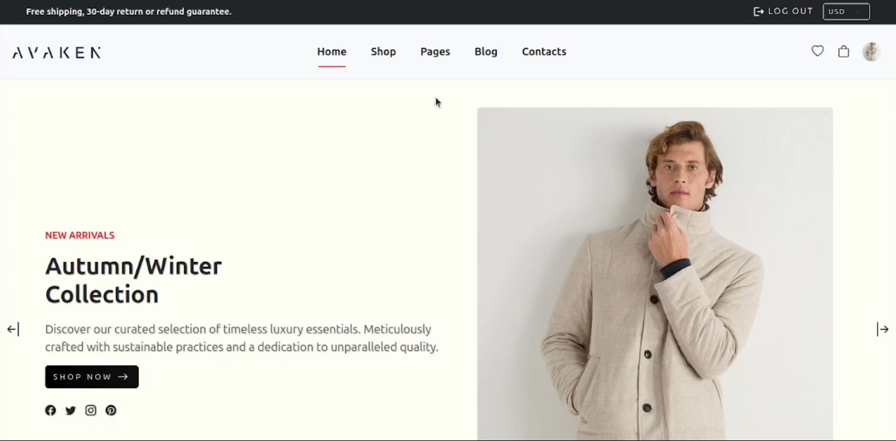

# E-Commerce Website

A simple e-commerce website built using modern technologies to provide a seamless shopping experience. This project includes product listings, user authentication, shopping cart functionality, order history, and more.

## Demo

[](https://youtu.be/1irNZTNZYB4?si=N-1jFcJ15CA-T9tU)

## Features

- **Product Listings**: View products with details such as price, description, and images.
- **User Authentication**: Register, log in, and manage user accounts securely.
- **Shopping Cart**: Add, update, and remove products in the cart.
- **Order Management**: Place orders, view order history, and track order statuses.
- **Responsive Design**: Optimized for mobile and desktop devices.
- **Optional Stripe Integration**: For secure and easy payment handling.

## Tech Stack

- **Frontend**: React.js
- **Backend**: Node.js (Express)
- **Database**: MongoDB
- **Optional**: Redis (for caching), Stripe (for payments)

## Installation and Setup

### Prerequisites
- Node.js and npm installed.
- MongoDB installed and running locally or a MongoDB Atlas account.

### Steps
1. Clone the repository:
   ```bash
   git clone https://github.com/your-username/ecommerce-website.git
   cd ecommerce-website
   ```

2. Install dependencies for both the frontend and backend:
   ```bash
   # Install backend dependencies
   cd backend
   npm install

   # Install frontend dependencies
   cd ../frontend
   npm install
   ```

3. Set up environment variables:
   - Create a `.env` file in the `backend` directory with the following keys:
     ```
     MONGO_URI=<your-mongo-db-connection-string>
     JWT_SECRET=<your-jwt-secret>
     STRIPE_SECRET_KEY=<your-stripe-secret-key> # Optional
     ```

4. Start the application:
   ```bash
   # Start the backend
   cd backend
   npm start

   # Start the frontend
   cd ../frontend
   npm start
   ```

5. Open your browser and navigate to `http://localhost:3000` to view the application.

## Folder Structure

```plaintext
.
├── backend/
│   ├── controllers/
│   ├── models/
│   ├── routes/
│   ├── middleware/
│   ├── config/
│   └── server.js
├── frontend/
│   ├── src/
│   │   ├── components/
│   │   ├── pages/
│   │   ├── context/
│   │   ├── utils/
│   │   └── App.js
├── README.md
└── .gitignore
```

## Roadmap

### Phase 1: Core Features
- [ ] User authentication
- [ ] Product listings
- [ ] Shopping cart
- [ ] Order history

### Phase 2: Enhancements
- [ ] Responsive design improvements
- [ ] Stripe payment integration
- [ ] Order management system
- [ ] Admin dashboard for product and order management

### Phase 3: Advanced Features
- [ ] Product reviews and ratings
- [ ] Wishlist functionality
- [ ] Recommendation engine
- [ ] Analytics dashboard

## Contributing

Contributions are welcome! To contribute:
1. Fork the repository.
2. Create a new branch (`git checkout -b feature-name`).
3. Commit your changes (`git commit -m 'Add some feature'`).
4. Push to the branch (`git push origin feature-name`).
5. Open a pull request.

## License

This project is licensed under the MIT License. See the `LICENSE` file for details.

## Acknowledgements

- [React](https://reactjs.org/)
- [Node.js](https://nodejs.org/)
- [MongoDB](https://www.mongodb.com/)
- [Stripe](https://stripe.com/)

